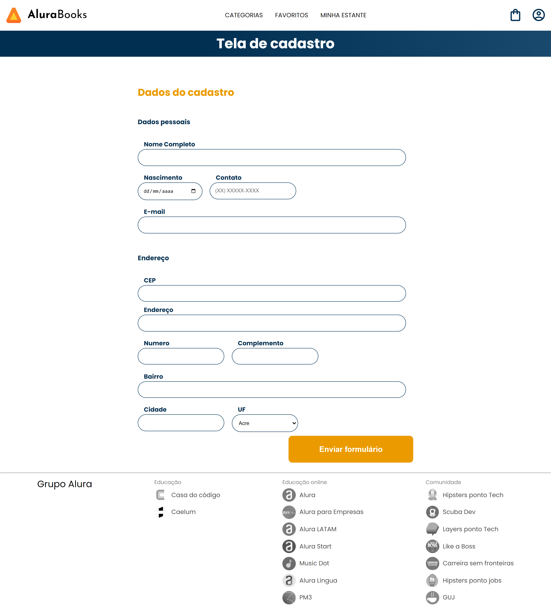

# Consumindo a API do ViaCEP 

Clique [AQUI](https://alineviana.github.io/consumindo-api-alura/) para acessar o projeto

 

> ## 📝 Conteúdo do curso: ✨ JavaScript: consumindo e tratando dados de uma API ✨
 

- Funcionamento JavaScript assíncrono
- Consumindo a API do ViaCEP com o fetch API
- Promises e seus métodos
- Async Await 
- Tratando possíveis erros de requisição retornados da API

 

> ## 🖥️ Tecnologias
 

- HTML5
- CSS3
- JavaScript